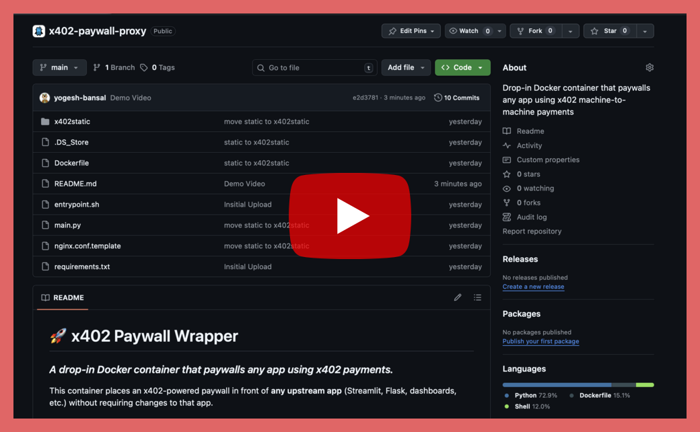

# 🚀 x402 Paywall Wrapper

### *A drop-in Docker container that paywalls **any app** using x402 payments.*

This container places an x402-powered paywall in front of **any upstream app** (Streamlit, Flask, dashboards, etc.) without requiring changes to that app.

It combines:

* **FastAPI + x402 middleware** for authorization
* **JWT session tokens** for access persistence
* **NGINX** reverse proxy with `auth_request`
* **Docker** for portability and simple deployment

Each container instance derives a unique cookie name from `JWT_SECRET`, so if you're running multiple paywalled apps on the same host, just give each one a different `JWT_SECRET`.

---

## 🎥 Demo Video

<p align="center">
  <a href="https://www.youtube.com/watch?v=RLHGR6_hIWA">
    
  </a>
</p>

---

## 🧱 Architecture

```
Browser → Paywall → JWT Cookie → NGINX → Your App
```

1. User pays via x402
2. FastAPI issues a JWT
3. NGINX validates the JWT on each request
4. Traffic is proxied to your upstream application only if authorized

---

## 🚀 Quick Start

### 1. Clone & build

```bash
git clone https://github.com/OmniacsDAO/x402-paywall-proxy.git
cd x402-wrapper
docker build -t x402-wrapper .
```

### 2. Run the container

```bash
docker run -d --rm \
  -e ADDRESS="<your-wallet-address>" \
  -e JWT_SECRET="super-secret-key" \
  -e X402_PRICE="0.001" \
  -e X402_NETWORK="base-sepolia" \
  -e X402_APP_NAME="x402 Paywall" \
  -e TOKEN_TTL_SECONDS=3600 \
  -e UPSTREAM_URL="http://192.168.11.98:4564" \
  -p 4022:4022 \
  --name x402-wrapper \
  x402-wrapper
```
💡 For multiple paywalled apps on the same host, use a different JWT_SECRET for each container so they each get their own cookie.

### 3. Access your paywalled app

```
http://<host-ip>:4022/
```

---

## 🔧 Environment Variables

| Variable              | Description                                                                         |
| --------------------- | ----------------------------------------------------------------------------------- |
| **ADDRESS**           | Wallet address receiving x402 payments                                              |
| **JWT_SECRET**        | Secret key for signing JWT cookies                                                  |
| **COOKIE_NAME**       | (Optional) Override cookie name; if unset, a name derived from `JWT_SECRET` is used |
| **X402_PRICE**        | Access price (numeric, no `$`)                                                      |
| **X402_NETWORK**      | Network (e.g., `base`, `base-sepolia`)                                              |
| **X402_APP_NAME**     | Branding shown in paywall                                                           |
| **X402_APP_LOGO**     | Logo path (`/x402static/...`)                                                           |
| **TOKEN_TTL_SECONDS** | Session lifetime                                                                    |
| **UPSTREAM_URL**      | The application being protected                                                     |


---

## 📁 File Structure

```
x402-wrapper/
├─ Dockerfile
├─ entrypoint.sh
├─ main.py
├─ nginx.conf.template
├─ requirements.txt
└─ x402static/
```

* **main.py** — FastAPI + x402 logic, JWT auth
* **nginx.conf.template** — Reverse proxy with dynamic upstream injection
* **entrypoint.sh** — Starts FastAPI and NGINX
* **Dockerfile** — Builds the unified image

---

## ✔ Summary

This wrapper gives you:

* A **portable, production-ready x402 paywall**
* Zero changes required to your original app
* Flexible pricing, network, and branding
* A simple Docker command to protect any internal tool or dashboard

---

## Contributing

PRs welcome! Open issues for bugs or ideas.

---

*Maintained with ❤️ by **Omniacs.DAO** – accelerating digital public goods through data.*

---
🛠️ Keep public infrastructure thriving. Buy [$IACS](http://dexscreener.com/base/0xd4d742cc8f54083f914a37e6b0c7b68c6005a024) on Base — CA: 0x46e69Fa9059C3D5F8933CA5E993158568DC80EBf
